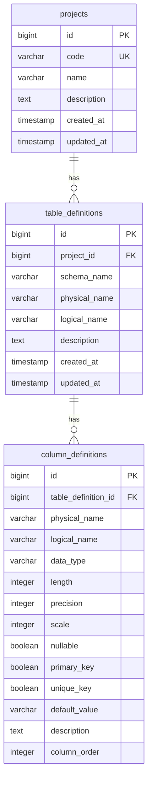

# データベース設計書

## 1. データベース概要

### 1.1 データベース構成
- **開発環境**: H2 Database (インメモリ)
- **本番環境**: PostgreSQL (Supabase対応)

### 1.2 文字コード
- UTF-8

### 1.3 命名規則
- テーブル名: スネークケース（小文字）
- カラム名: スネークケース（小文字）
- インデックス名: `idx_<table_name>_<column_name>`
- 外部キー名: `fk_<table_name>_<referenced_table_name>`

## 2. テーブル定義詳細

### 2.1 projects（プロジェクト）

#### テーブル情報
| 項目 | 値 |
|------|-----|
| テーブル名（物理） | projects |
| テーブル名（論理） | プロジェクト |
| 説明 | テーブル定義を管理するプロジェクト |

#### カラム定義
| # | カラム名（物理） | カラム名（論理） | データ型 | 長さ | NULL | PK | UK | デフォルト | 説明 |
|---|-----------------|-----------------|----------|------|------|----|----|-----------|------|
| 1 | id | ID | BIGINT | - | × | ○ | × | AUTO_INCREMENT | プライマリキー |
| 2 | code | プロジェクトコード | VARCHAR | 50 | × | × | ○ | - | プロジェクト識別コード |
| 3 | name | プロジェクト名 | VARCHAR | 100 | × | × | × | - | プロジェクト名 |
| 4 | description | 説明 | TEXT | - | ○ | × | × | - | プロジェクトの説明 |
| 5 | created_at | 作成日時 | TIMESTAMP | - | × | × | × | CURRENT_TIMESTAMP | レコード作成日時 |
| 6 | updated_at | 更新日時 | TIMESTAMP | - | × | × | × | CURRENT_TIMESTAMP | レコード更新日時 |

#### インデックス
| インデックス名 | カラム | 種別 |
|---------------|--------|------|
| PRIMARY | id | PRIMARY KEY |
| uk_projects_code | code | UNIQUE |
| idx_projects_code | code | INDEX |

### 2.2 table_definitions（テーブル定義）

#### テーブル情報
| 項目 | 値 |
|------|-----|
| テーブル名（物理） | table_definitions |
| テーブル名（論理） | テーブル定義 |
| 説明 | データベースのテーブル定義情報 |

#### カラム定義
| # | カラム名（物理） | カラム名（論理） | データ型 | 長さ | NULL | PK | UK | デフォルト | 説明 |
|---|-----------------|-----------------|----------|------|------|----|----|-----------|------|
| 1 | id | ID | BIGINT | - | × | ○ | × | AUTO_INCREMENT | プライマリキー |
| 2 | project_id | プロジェクトID | BIGINT | - | × | × | × | - | 所属プロジェクト |
| 3 | schema_name | スキーマ名 | VARCHAR | 255 | ○ | × | × | - | データベーススキーマ名 |
| 4 | physical_name | 物理名 | VARCHAR | 255 | × | × | × | - | テーブル物理名 |
| 5 | logical_name | 論理名 | VARCHAR | 255 | × | × | × | - | テーブル論理名 |
| 6 | description | 説明 | TEXT | - | ○ | × | × | - | テーブルの説明 |
| 7 | created_at | 作成日時 | TIMESTAMP | - | × | × | × | CURRENT_TIMESTAMP | レコード作成日時 |
| 8 | updated_at | 更新日時 | TIMESTAMP | - | × | × | × | CURRENT_TIMESTAMP | レコード更新日時 |

#### インデックス
| インデックス名 | カラム | 種別 |
|---------------|--------|------|
| PRIMARY | id | PRIMARY KEY |
| idx_table_definitions_project_id | project_id | INDEX |
| uk_project_physical_name | project_id, physical_name | UNIQUE |

#### 外部キー
| 外部キー名 | カラム | 参照テーブル | 参照カラム | ON DELETE |
|-----------|--------|-------------|-----------|-----------|
| fk_project | project_id | projects | id | CASCADE |

### 2.3 column_definitions（カラム定義）

#### テーブル情報
| 項目 | 値 |
|------|-----|
| テーブル名（物理） | column_definitions |
| テーブル名（論理） | カラム定義 |
| 説明 | テーブルのカラム定義情報 |

#### カラム定義
| # | カラム名（物理） | カラム名（論理） | データ型 | 長さ | NULL | PK | UK | デフォルト | 説明 |
|---|-----------------|-----------------|----------|------|------|----|----|-----------|------|
| 1 | id | ID | BIGINT | - | × | ○ | × | AUTO_INCREMENT | プライマリキー |
| 2 | table_definition_id | テーブル定義ID | BIGINT | - | × | × | × | - | 所属テーブル |
| 3 | physical_name | 物理名 | VARCHAR | 255 | × | × | × | - | カラム物理名 |
| 4 | logical_name | 論理名 | VARCHAR | 255 | × | × | × | - | カラム論理名 |
| 5 | data_type | データ型 | VARCHAR | 50 | × | × | × | - | データ型 |
| 6 | length | 長さ | INTEGER | - | ○ | × | × | - | データ長 |
| 7 | precision | 精度 | INTEGER | - | ○ | × | × | - | 数値の精度 |
| 8 | scale | スケール | INTEGER | - | ○ | × | × | - | 小数点以下の桁数 |
| 9 | nullable | NULL許可 | BOOLEAN | - | × | × | × | true | NULL値の許可 |
| 10 | primary_key | プライマリキー | BOOLEAN | - | × | × | × | false | PKフラグ |
| 11 | unique_key | ユニークキー | BOOLEAN | - | × | × | × | false | UKフラグ |
| 12 | default_value | デフォルト値 | VARCHAR | 255 | ○ | × | × | - | デフォルト値 |
| 13 | description | 説明 | TEXT | - | ○ | × | × | - | カラムの説明 |
| 14 | column_order | カラム順序 | INTEGER | - | × | × | × | - | 表示順序 |

#### インデックス
| インデックス名 | カラム | 種別 |
|---------------|--------|------|
| PRIMARY | id | PRIMARY KEY |
| idx_column_definitions_table_id | table_definition_id | INDEX |

#### 外部キー
| 外部キー名 | カラム | 参照テーブル | 参照カラム | ON DELETE |
|-----------|--------|-------------|-----------|-----------|
| fk_table_definition | table_definition_id | table_definitions | id | CASCADE |

## 3. データ型マッピング

### 3.1 サポートするデータ型
| データ型 | PostgreSQL | H2 | 説明 |
|---------|------------|-----|------|
| VARCHAR | VARCHAR(n) | VARCHAR(n) | 可変長文字列 |
| CHAR | CHAR(n) | CHAR(n) | 固定長文字列 |
| TEXT | TEXT | TEXT | 長文テキスト |
| INTEGER | INTEGER | INTEGER | 整数 |
| BIGINT | BIGINT | BIGINT | 長整数 |
| DECIMAL | DECIMAL(p,s) | DECIMAL(p,s) | 固定小数点数 |
| NUMERIC | NUMERIC(p,s) | NUMERIC(p,s) | 数値 |
| FLOAT | REAL | FLOAT | 浮動小数点数 |
| DOUBLE | DOUBLE PRECISION | DOUBLE | 倍精度浮動小数点数 |
| DATE | DATE | DATE | 日付 |
| TIME | TIME | TIME | 時刻 |
| TIMESTAMP | TIMESTAMP | TIMESTAMP | タイムスタンプ |
| BOOLEAN | BOOLEAN | BOOLEAN | 真偽値 |
| BINARY | BYTEA | BINARY | バイナリ |
| VARBINARY | BYTEA | VARBINARY | 可変長バイナリ |
| BLOB | BYTEA | BLOB | バイナリラージオブジェクト |
| CLOB | TEXT | CLOB | 文字ラージオブジェクト |
| JSON | JSON/JSONB | JSON | JSON |
| XML | XML | XML | XML |

## 4. ER図



## 5. シーケンス定義

### 5.1 PostgreSQL
各テーブルのIDカラムは、PostgreSQLの`BIGSERIAL`型を使用して自動採番されます。

### 5.2 H2 Database
H2データベースでは、`BIGINT AUTO_INCREMENT`を使用して自動採番されます。

## 6. トリガー定義

### 6.1 updated_atの自動更新（PostgreSQL）
PostgreSQLでは、以下のトリガー関数とトリガーが定義されています：

```sql
-- トリガー関数
CREATE OR REPLACE FUNCTION update_updated_at_column()
RETURNS TRIGGER AS $$
BEGIN
    NEW.updated_at = CURRENT_TIMESTAMP;
    RETURN NEW;
END;
$$ language 'plpgsql';

-- 各テーブルのトリガー
CREATE TRIGGER update_projects_updated_at 
    BEFORE UPDATE ON projects 
    FOR EACH ROW 
    EXECUTE FUNCTION update_updated_at_column();

CREATE TRIGGER update_table_definitions_updated_at 
    BEFORE UPDATE ON table_definitions 
    FOR EACH ROW 
    EXECUTE FUNCTION update_updated_at_column();
```

### 6.2 H2 Database
H2では、アプリケーション側（JPA）で`updated_at`の更新を管理しています。

## 7. パフォーマンス考慮事項

### 7.1 インデックス戦略
- 外部キーには自動的にインデックスを作成
- 検索頻度の高いカラムにインデックスを設定
- 複合ユニークキーにはインデックスを設定
- プロジェクトコードには検索用インデックスを設定

### 7.2 接続プール設定（本番環境）
- 最大接続数: 10
- 最小アイドル接続数: 2
- 接続タイムアウト: 30秒
- アイドルタイムアウト: 10分
- 最大生存時間: 30分
- リーク検出閾値: 60秒

## 8. バックアップ・リカバリ

### 8.1 開発環境（H2）
- インメモリDBのため、再起動時にデータは失われる
- 初期スキーマは`schema-h2.sql`で定義

### 8.2 本番環境（PostgreSQL/Supabase）
- Supabaseの自動バックアップ機能を利用
- 定期的なバックアップが自動実行される
- ポイントインタイムリカバリが利用可能
- `pg_dump`コマンドを使用した手動バックアップも可能

### 8.3 スキーマ管理
- **H2用スキーマ**: `schema-h2.sql`
- **PostgreSQL用スキーマ**: `schema-postgresql.sql`
- 環境に応じて適切なスキーマファイルが自動選択される
- `spring.sql.init.mode`の設定により初期化を制御

## 9. Supabase固有の考慮事項

### 9.1 接続設定
- Connection Poolingを使用する場合、ポート番号は`6543`
- 直接接続の場合、ポート番号は`5432`
- SSL接続が推奨される

### 9.2 環境変数
- `SUPABASE_DB_HOST`: データベースホスト
- `SUPABASE_DB_PORT`: ポート番号
- `SUPABASE_DB_NAME`: データベース名（通常は`postgres`）
- `SUPABASE_DB_USERNAME`: ユーザー名
- `SUPABASE_DB_PASSWORD`: パスワード

### 9.3 制限事項
- 同時接続数の制限あり（プランによる）
- ストレージ容量の制限あり（プランによる）
- 無料プランでは1週間非アクティブでデータベースが一時停止される