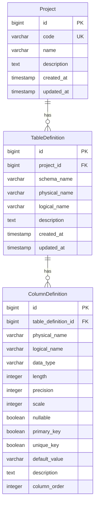

# テーブル定義管理システム 設計書

## 1. システム概要

### 1.1 目的
本システムは、データベースのテーブル定義情報をプロジェクト単位で管理し、ドキュメント化を支援するWebアプリケーションです。プロジェクト管理機能、テーブル定義の作成・編集、およびExcel、Markdown、DDL形式でのエクスポート機能を提供します。

### 1.2 主要機能
- **プロジェクト管理**: プロジェクトの作成・編集・削除
- **テーブル定義管理**: テーブル定義の作成・編集・削除
- **カラム定義管理**: 詳細なカラム属性の設定
- **多言語対応**: 日本語メッセージサポート
- **エクスポート機能**: Excel/Markdown/DDL形式での出力
- **環境対応**: 開発環境（H2）・本番環境（PostgreSQL/Supabase）

### 1.3 システム特徴
- Spring MVCによるWebアプリケーション
- プロジェクト単位でのテーブル管理
- 豊富なデータ型サポート
- Docker対応による環境構築の簡略化
- 環境変数による設定管理

## 2. アーキテクチャ

### 2.1 技術スタック
- **バックエンド**: Java 17, Spring Boot 3.2.0, Spring Data JPA
- **フロントエンド**: Thymeleaf, Bootstrap 5, JavaScript
- **データベース**: 
  - 開発環境: H2 Database（インメモリ）
  - 本番環境: PostgreSQL（Supabase対応）
- **ビルドツール**: Gradle 8.5
- **コンテナ**: Docker, Docker Compose
- **エクスポート**: Apache POI (Excel), カスタムジェネレータ（Markdown/DDL）

### 2.2 アーキテクチャ層構成
```
┌─────────────────────────────────────┐
│      Presentation Layer             │
│  (Controller, Thymeleaf Templates)  │
│  - ProjectController                │
│  - TableDefinitionController        │
├─────────────────────────────────────┤
│       Business Logic Layer          │
│         (Service Classes)           │
│  - ProjectService                   │
│  - TableDefinitionService           │
│  - ExportService                    │
├─────────────────────────────────────┤
│      Data Access Layer              │
│   (Repository, Entity Classes)      │
│  - ProjectRepository                │
│  - TableDefinitionRepository        │
├─────────────────────────────────────┤
│         Database Layer              │
│    (H2/PostgreSQL Database)         │
│  - Schema Management                │
│  - Connection Pooling               │
└─────────────────────────────────────┘
```

### 2.3 アプリケーション構成
```
┌─────────────────────┐
│   Web Browser       │
└─────────┬───────────┘
          │ HTTP/HTTPS
┌─────────▼───────────┐
│   Spring Boot App   │
│   (Port 8080)      │
├─────────────────────┤
│   Thymeleaf         │
│   Templates         │
├─────────────────────┤
│   Spring MVC        │
│   Controllers       │
├─────────────────────┤
│   Business Logic    │
│   Services          │
├─────────────────────┤
│   Spring Data JPA   │
│   Repositories      │
├─────────────────────┤
│   Database          │
│   H2 / PostgreSQL   │
└─────────────────────┘
```

## 3. データモデル

### 3.1 エンティティ関連図


### 3.2 Project（プロジェクト）
| カラム名 | 型 | 制約 | 説明 |
|---------|-----|------|------|
| id | BIGINT | PRIMARY KEY, AUTO_INCREMENT | プライマリキー |
| code | VARCHAR(50) | NOT NULL, UNIQUE | プロジェクトコード |
| name | VARCHAR(100) | NOT NULL | プロジェクト名 |
| description | TEXT | | プロジェクトの説明 |
| created_at | TIMESTAMP | NOT NULL, DEFAULT CURRENT_TIMESTAMP | 作成日時 |
| updated_at | TIMESTAMP | NOT NULL, DEFAULT CURRENT_TIMESTAMP | 更新日時 |

### 3.3 TableDefinition（テーブル定義）
| カラム名 | 型 | 制約 | 説明 |
|---------|-----|------|------|
| id | BIGINT | PRIMARY KEY, AUTO_INCREMENT | プライマリキー |
| project_id | BIGINT | NOT NULL, FOREIGN KEY | プロジェクトID |
| schema_name | VARCHAR(255) | | スキーマ名 |
| physical_name | VARCHAR(255) | NOT NULL | 物理名 |
| logical_name | VARCHAR(255) | NOT NULL | 論理名 |
| description | TEXT | | テーブルの説明 |
| created_at | TIMESTAMP | NOT NULL, DEFAULT CURRENT_TIMESTAMP | 作成日時 |
| updated_at | TIMESTAMP | NOT NULL, DEFAULT CURRENT_TIMESTAMP | 更新日時 |

**制約:**
- UNIQUE(project_id, physical_name) - プロジェクト内でのテーブル物理名の重複防止

### 3.4 ColumnDefinition（カラム定義）
| カラム名 | 型 | 制約 | 説明 |
|---------|-----|------|------|
| id | BIGINT | PRIMARY KEY, AUTO_INCREMENT | プライマリキー |
| table_definition_id | BIGINT | NOT NULL, FOREIGN KEY | テーブル定義ID |
| physical_name | VARCHAR(255) | NOT NULL | 物理名 |
| logical_name | VARCHAR(255) | NOT NULL | 論理名 |
| data_type | VARCHAR(50) | NOT NULL | データ型 |
| length | INTEGER | | 長さ |
| precision | INTEGER | | 精度 |
| scale | INTEGER | | スケール |
| nullable | BOOLEAN | NOT NULL DEFAULT true | NULL許可 |
| primary_key | BOOLEAN | NOT NULL DEFAULT false | プライマリキー |
| unique_key | BOOLEAN | NOT NULL DEFAULT false | ユニークキー |
| default_value | VARCHAR(255) | | デフォルト値 |
| description | TEXT | | カラムの説明 |
| column_order | INTEGER | NOT NULL | カラム順序 |

## 4. パッケージ構成

```
com.example.tabledef/
├── TableDefinitionApplication.java  # メインクラス
├── controller/                      # Webコントローラー
│   ├── ProjectController.java       # プロジェクト管理
│   └── TableDefinitionController.java # テーブル定義管理
├── dto/                            # データ転送オブジェクト
│   ├── ProjectDto.java
│   ├── TableDefinitionDto.java
│   └── ColumnDefinitionDto.java
├── model/                          # JPA エンティティ
│   ├── Project.java
│   ├── TableDefinition.java
│   └── ColumnDefinition.java
├── repository/                     # データアクセス層
│   ├── ProjectRepository.java
│   └── TableDefinitionRepository.java
├── service/                        # ビジネスロジック層
│   ├── ProjectService.java
│   ├── TableDefinitionService.java
│   └── ExportService.java
├── config/                         # 設定クラス
│   └── WebConfig.java              # Web設定
└── util/                          # ユーティリティ
    └── (将来の拡張用)
```

## 5. 画面構成

### 5.1 画面遷移図
```
/ (ルート)
├── /projects (プロジェクト一覧)
│   ├── /projects/new (プロジェクト新規作成)
│   ├── /projects/{id}/edit (プロジェクト編集)
│   └── /projects/{projectId}/tables (テーブル一覧)
│       ├── /projects/{projectId}/tables/new (テーブル新規作成)
│       ├── /projects/{projectId}/tables/{id}/edit (テーブル編集)
│       └── /projects/{projectId}/export/* (エクスポート)
```

### 5.2 画面一覧
| 画面名 | パス | テンプレート | 説明 |
|--------|------|-------------|------|
| ルート | `/` | - | プロジェクト一覧へリダイレクト |
| プロジェクト一覧 | `/projects` | project-list.html | プロジェクトの一覧表示 |
| プロジェクト作成・編集 | `/projects/new`, `/projects/{id}/edit` | project-form.html | プロジェクト情報の入力・編集 |
| テーブル一覧 | `/projects/{projectId}/tables` | index.html | プロジェクト内のテーブル一覧 |
| テーブル作成・編集 | `/projects/{projectId}/tables/new`, `/projects/{projectId}/tables/{id}/edit` | table-form.html | テーブル定義の入力・編集 |

### 5.3 静的リソース
```
static/
├── css/
│   └── style.css          # カスタムスタイル
└── js/
    └── app.js             # JavaScript機能
```

## 6. API仕様

### 6.1 プロジェクト関連
- `GET /` - ルートアクセス（プロジェクト一覧へリダイレクト）
- `GET /projects` - プロジェクト一覧表示
- `GET /projects/new` - プロジェクト新規作成画面
- `POST /projects` - プロジェクト作成
- `GET /projects/{id}/edit` - プロジェクト編集画面
- `POST /projects/{id}` - プロジェクト更新
- `POST /projects/{id}/delete` - プロジェクト削除

### 6.2 テーブル定義関連
- `GET /projects/{projectId}/tables` - テーブル一覧表示
- `GET /projects/{projectId}/tables/new` - テーブル新規作成画面
- `GET /projects/{projectId}/tables/{id}/edit` - テーブル編集画面
- `POST /projects/{projectId}/tables` - テーブル作成・更新
- `POST /projects/{projectId}/tables/{id}/delete` - テーブル削除

### 6.3 エクスポート関連
- `GET /projects/{projectId}/export/excel?tableId={tableId}` - Excel形式でエクスポート
- `GET /projects/{projectId}/export/markdown?tableId={tableId}` - Markdown形式でエクスポート
- `GET /projects/{projectId}/export/ddl?tableId={tableId}` - DDL形式でエクスポート

## 7. 設定管理

### 7.1 環境プロファイル
- **デフォルト/開発環境**: H2インメモリデータベース
- **本番環境（prod）**: PostgreSQL/Supabase

### 7.2 設定ファイル
- `application.yml` - 共通設定
- `application-dev.yml` - 開発環境設定
- `application-prod.yml` - 本番環境設定

### 7.3 環境変数（本番環境）
| 変数名 | 説明 | デフォルト値 |
|--------|------|------------|
| `SPRING_PROFILES_ACTIVE` | アクティブプロファイル | - |
| `SUPABASE_DB_HOST` | データベースホスト | db.your-project.supabase.co |
| `SUPABASE_DB_PORT` | データベースポート | 5432 |
| `SUPABASE_DB_NAME` | データベース名 | postgres |
| `SUPABASE_DB_USERNAME` | データベースユーザー名 | postgres |
| `SUPABASE_DB_PASSWORD` | データベースパスワード | - |

## 8. セキュリティ

### 8.1 現在の実装
- Spring Securityは未実装（CSRF保護なし）
- 認証・認可機能なし
- 入力値のバリデーション実装済み
- SQLインジェクション対策（JPA使用）

### 8.2 今後の検討事項
- Spring Securityの導入
- ユーザー認証機能の追加
- プロジェクト単位でのアクセス制御
- CSRF保護の実装

## 9. 国際化対応

### 9.1 対応言語
- 日本語（ja）- メインサポート言語

### 9.2 メッセージリソース
- `src/main/resources/i18n/messages_ja.properties` - 日本語メッセージ

### 9.3 メッセージキー
- プロジェクト関連: `project.created`, `project.updated`, `project.deleted`
- テーブル関連: `table.created`, `table.updated`, `table.deleted`
- エラーメッセージ: `project.delete.error`

## 10. 開発環境

### 10.1 必要なソフトウェア
- **JDK**: 17以上
- **Gradle**: 7.6以上（Gradle Wrapper使用可）
- **Docker & Docker Compose**: コンテナ使用時
- **IDE**: IntelliJ IDEA, Eclipse, VS Code等

### 10.2 開発環境セットアップ
```bash
# リポジトリクローン
git clone <repository-url>
cd table-definition-app

# 環境変数設定（.envファイルをコピー）
cp .env.example .env

# アプリケーション起動
./gradlew bootRun
```

### 10.3 Docker開発環境
```bash
# Docker Composeでの起動
docker-compose up -d

# ログ確認
docker-compose logs -f app
```

## 11. デプロイメント

### 11.1 ビルド
```bash
# アプリケーションビルド
./gradlew build

# JARファイル生成場所
build/libs/table-definition-app-0.0.1-SNAPSHOT.jar
```

### 11.2 実行方法
#### 開発環境
```bash
./gradlew bootRun
```

#### 本番環境（JARファイル直接実行）
```bash
# 環境変数設定
export SPRING_PROFILES_ACTIVE=prod
export SUPABASE_DB_HOST=your-host
export SUPABASE_DB_USERNAME=your-username
export SUPABASE_DB_PASSWORD=your-password

# アプリケーション実行
java -jar build/libs/table-definition-app-0.0.1-SNAPSHOT.jar
```

#### Docker環境
```bash
# .envファイル設定後
docker-compose up -d
```

### 11.3 Supabaseデプロイ
1. Supabaseプロジェクト作成
2. スキーマファイル実行（`schema-postgresql.sql`）
3. 環境変数設定
4. アプリケーション起動

## 12. パフォーマンス考慮事項

### 12.1 データベース最適化
- インデックス設定（外部キー、検索用カラム）
- 接続プールの設定（HikariCP）
- クエリ最適化（JPA/Hibernate）

### 12.2 接続プール設定
```yaml
spring:
  datasource:
    hikari:
      maximum-pool-size: 10
      minimum-idle: 2
      connection-timeout: 30000
      idle-timeout: 600000
      max-lifetime: 1800000
```

### 12.3 メモリ管理
- H2インメモリDB（開発環境）
- PostgreSQL（本番環境）
- 適切なJVMヒープサイズ設定

## 13. 監視・ログ

### 13.1 アプリケーションログ
- Spring Bootデフォルトログ設定
- ログレベル制御（application.yml）
- ビジネスロジックのログ出力

### 13.2 ヘルスチェック
- Spring Boot Actuatorの活用（将来的）
- データベース接続状態の監視

## 14. バックアップ・リカバリ

### 14.1 開発環境
- H2インメモリDB（データの永続化なし）
- アプリケーション再起動でリセット

### 14.2 本番環境（Supabase）
- 自動バックアップ機能
- ポイントインタイムリカバリ
- 手動エクスポート機能（pg_dump）

## 15. 今後の拡張予定

### 15.1 短期計画
1. **セキュリティ強化**
   - Spring Security導入
   - ユーザー認証・認可

2. **UI/UX改善**
   - レスポンシブデザイン強化
   - エラーハンドリング改善

### 15.2 中期計画
1. **機能拡張**
   - データベーススキーマインポート
   - ER図自動生成
   - バージョン管理機能

2. **API化**
   - REST API提供
   - 外部システム連携

### 15.3 長期計画
1. **エンタープライズ機能**
   - マルチテナント対応
   - ワークフロー機能
   - 承認プロセス

2. **クラウドネイティブ化**
   - マイクロサービス化
   - Kubernetes対応
   - CI/CD強化

## 16. 制約事項・既知の問題

### 16.1 現在の制限
- 認証機能なし
- 同時編集の排他制御なし
- ファイルアップロード機能なし
- 一度に1テーブルのみエクスポート可能

### 16.2 パフォーマンス制限
- 大量データ処理の最適化が必要
- リアルタイム更新機能なし
- キャッシュ機能なし

### 16.3 ブラウザ互換性
- モダンブラウザのみサポート
- Internet Explorer非対応